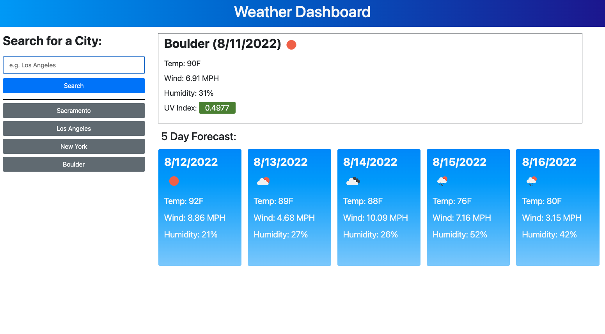

# Jacob Canepa's Weather Dashboard

## Description
This simple application uses the OpenWeatherMapAPI in order to display a weekly forecast for whatever location the user chooses.

## Table of Contents
- [Usage](#usage)
- [Questions](#questions)

## Usage
WEATHER DASHBOARD: https://jacobmcanepa.github.io/weather-dashboard/

Just enter a location into the search bar to see the forecast.

## Questions
Github: https://github.com/jacobmcanepa

Email: jacobmcanepa@gmail.com
